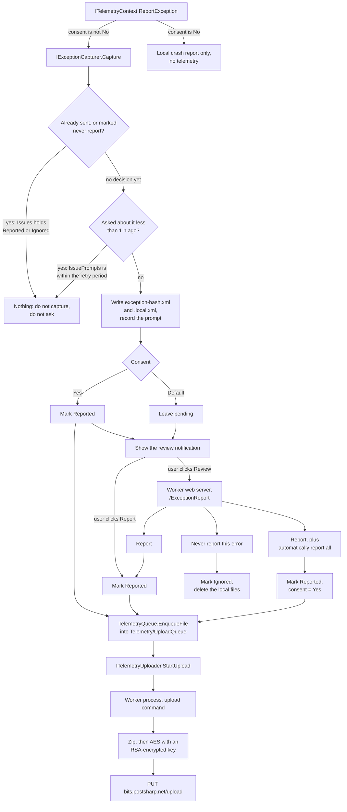

# Telemetry

This document describes how telemetry works inside `Metalama.Backstage`: what the channels are, how consent is resolved, how an exception report travels from the failure that produced it to our servers, and which invariants must not be broken. It exists because the subsystem spans five processes and three configuration files, and because a mistake in it is invisible: nothing fails, reports simply stop arriving. That is exactly what happened in 2026.1.18 (see [#1751](https://github.com/metalama/Metalama/issues/1751)).

For the user-facing description, see `content/conceptual/configuration/telemetry.md` in `Metalama.Documentation`.

## Channels

| Scenario | What it carries | Sent |
|---|---|---|
| `TelemetryScenario.Usage` | Per-project metrics: hashed project name, target framework, project size, aspect count, timings | Automatically, opt-out |
| `TelemetryScenario.Exception` | An anonymized exception report | Review-first by default |
| `TelemetryScenario.Performance` | The same report shape, for a performance degradation | Review-first by default |

The **license audit** (`Metalama.Backstage.Licensing.Audit`) is not one of these. It deliberately ignores every telemetry setting, so it must never be routed through `ITelemetryPolicy`.

## Consent

`TelemetryConsent` has three values, and their meaning depends on the scenario:

| | `Usage` | `Exception` / `Performance` |
|---|---|---|
| `Default` | collect and send (promoted to `Yes` on first use) | **ask**: capture locally, notify, do not send |
| `Yes` | collect and send | capture, notify, and send immediately |
| `No` | do not collect | do not capture, do not ask |

`Default` is *not* "unset then treated as `No`" for exceptions: it is a real, distinct state, and it is the state almost every installation is in. Any change that treats `Default` as equivalent to either neighbour will silently change what users are asked or what we receive.

Only `Usage` is ever promoted automatically (`TelemetryContext.EnableTelemetryIfDefault`). Nothing promotes `Exception` or `Performance`: the user must act, through the privacy page, the review page checkbox, or `metalama telemetry`.

## Resolving whether we may report

Three gates apply, in this order. `ITelemetryPolicy` composes them, and `ITelemetryContext` is the only public way to report.

1. **Process-level** (`TelemetryConfigurationService.ComputeGlobalTelemetryDisabledReason`): the application declares `IsTelemetryEnabled`, the process is unattended (CI, build server, `Environment.UserInteractive == false`), or `METALAMA_TELEMETRY_OPT_OUT` is set. Any of these disables every scenario. This is why CI never reports and why no prompt loop can run there.
2. **Repository** (`TelemetryService.GetPolicy`): `metalama.json` at the repository root may set `telemetry.enabled = false`. A directory that is not inside a git repository has no repository to consult and yields `NullTelemetryPolicy.NoContext`, which disables everything.
3. **Per-scenario consent**, as above.

`GetConsentAndReason` returns the `TelemetryDisabledReason` alongside the consent so that `metalama telemetry status` can explain *why* a category is off. Keep that reason accurate: it is the only diagnostic a user has.

> **Rule.** Never call `IExceptionCapturer` directly. It carries an already-resolved consent and exists only so `TelemetryContext` can pass it. Reporting outside `ITelemetryContext` bypasses all three gates.

## Lazy activation

The device identifier and the anonymization salts are created on demand by `ITelemetryConfigurationService.EnsureActivated`, not at startup. A process that never reports must leave `telemetry.json` untouched and must never create a device identifier.

`GetSalt` throws if the configuration is not activated rather than returning a zeroed salt, because a zero salt would produce the *same* pseudonym on every not-yet-activated machine. Call `EnsureActivated` before reading a salt.

## Anonymization

Each channel hashes the device identifier with its **own** salt (`TelemetrySaltKind`), so the Matomo dataset, the usage-tracking data and the exception reports cannot be joined. The raw `DeviceId` GUID never leaves the machine.

An exception report is rendered twice, by `ExceptionReporter.BuildReport`:

- the **scrubbed** rendering (`exception-<hash>.xml`), which is the exact upload payload: exception messages, paths and user or third-party assembly identities are removed (`ExceptionSensitiveDataHelper`, `ExceptionReporter.WriteAssemblyElement`);
- the **full local** rendering (`exception-<hash>.local.xml`), which keeps everything so the review page can show both side by side.

> **Rule.** The `.local.xml` file must never be uploaded. `IsValidScrubbedReportFileName` rejects it, and it is never enqueued. Anything that moves files into the upload queue must preserve that.

## The life of an exception report



### The issue signature

`ComputeExceptionHash` builds the signature from the **package version**, the exception type name and the cleaned stack frames. Consecutive user frames collapse to a single `#user`.

Including the version means signatures do not survive an upgrade. That is deliberate: a new version may behave differently, so we ask again. It also means no configuration migration is ever needed when the meaning of an entry in `Issues` changes.

### Deciding, and asking again

`TelemetryConfiguration` holds two dictionaries keyed by the signature:

- `Issues` holds only **terminal decisions**: `Reported` (the report was actually sent) and `Ignored` (the user asked never to report it).
- `IssuePrompts` holds **when the user was last asked**, and is pruned as it is written so it only ever holds the last hour.

> **Rule.** Capturing a report is not a decision. `Reported` is written when the report is on its way: by `SendReport`, and by `Capture` when the consent is `Yes`. Writing it at capture time is precisely the bug that produced zero exception reports for four releases: a notification the user ignored silenced the issue forever.

An issue with no terminal decision is captured and prompted again once `ExceptionReporter.PromptRetryPeriod` (1 hour) has elapsed, every time it recurs, until the user picks one of the three outcomes. The pending report file is keyed by hash alone and overwritten, so a recurring issue produces one report, not one per hour.

The notification offers **Review** and **Report**. Report (`ReportExceptionCommand`) sends the same scrubbed report without opening the review page, so the fast path to yes costs one click while opting an issue out still costs a page visit.

> **Rule.** A process that acts on a user gesture and then exits must await `BackstageBackgroundTasksService.Default.CompleteAsync()` first. Sending a report starts the upload through that queue, and `Environment.Exit` would kill a task that has not started yet. The desktop application does it in `App.RunAppAsync`.

## Notifications

`ToastNotificationKind` describes a notification kind; `ToastNotificationStatusService` stores per-kind state in `toastNotifications.json`.

| Control | Effect | Duration |
|---|---|---|
| auto-snooze | applied by `TryAcquire` when a notification is shown | `AutoSnoozePeriod` (5 s for `ExceptionReport`) |
| Snooze | user action | `ManualSnoozePeriod` |
| Mute | user action, sets `Disabled` | forever, and there is no un-mute in the product |

Mute is permanent and cannot be undone from the product, so it is unacceptable on a notification that is the only way to take an action. `ToastNotificationKind.CanBeMuted` expresses this: for such a kind the notification offers no Mute button, `Mute` is a no-op, and a `Disabled` flag is ignored on read.

`ToastNotificationKinds.ExceptionReport` is shared by the exception and performance channels, and cannot be muted.

> **Migration.** Per-kind state is keyed by `kind.Name`, so **renaming a kind discards everything stored for it**. That is how the mutes written by 2026.1.18 to 2026.1.21, when the error-report notification still had a Mute button, were cleared: the kind was renamed from `Exception` to `ExceptionReport` in 2026.1.22. Renaming a kind is therefore a deliberate, one-time reset of its snooze and mute state, never a cosmetic change.

## Uploading

`TelemetryQueue.EnqueueFile` moves a file into `Telemetry\UploadQueue`. `TelemetryUploader.UploadAsync` packs **everything** in that directory into one zip, encrypts it (random AES key, itself RSA-encrypted with the embedded public key) and PUTs it. Usage reports, license-audit reports and exception reports all travel this way.

`StartUpload` is throttled to once a day unless `force: true`, which the review page uses because the user explicitly asked. It delegates to a separate worker process, so it needs `IBackstageToolsExecutor`; when that service is absent it is a no-op and the file simply waits for the next process start (`BackstageServicesInitializer`).

## Configuration files

| File | Scope | Contents |
|---|---|---|
| `telemetry.json` | user | consent per scenario, device id, salts, `Issues`, `IssuePrompts`, `Sessions`, retention |
| `toastNotifications.json` | user | per-kind snooze / mute, last notification time |
| `metalama.json` | repository, committed | `telemetry.enabled` |

All of these are editable with `metalama config edit <alias>`, so **assume any property may be missing or null**.

> **Rule.** A property absent from the JSON deserializes to `null`, *not* to its property initializer. Every collection property on a `ConfigurationFile` must therefore normalize `null` in its `init` accessor (`with` expressions go through it too). Relying on the initializer alone produces a `NullReferenceException` on the first read after the property is introduced, on every existing installation.

Data under `Telemetry` is deleted after `RetentionPeriodInDays` (30 by default) by `TempFileManager`, including reports still awaiting review.

## Testing it

```powershell
# Capture a report and show the review notification. Requires the current directory to be inside a git repository.
metalama throw

# A distinct signature, to check that a decision on one issue does not affect another.
metalama throw --variant b

# Forget all decisions and prompts, so the next occurrence asks again immediately.
metalama telemetry reset-dedup

# What is configured, what is in effect, and why they differ.
metalama telemetry status
```

`metalama throw` turns on the user-interface services itself; other commands only add them with the hidden `--with-ui` flag, and without them a report is captured with no notification at all.

Unit tests live in `Metalama.Backstage.Tests/Telemetry` (capture, decisions, prompting), `Metalama.Backstage.Tests/UserInterface` (notification state) and `Metalama.Backstage.Worker.Tests` (the review page). Use `TestDateTimeProvider.AddTime` to cross the retry period; never use a real delay.
